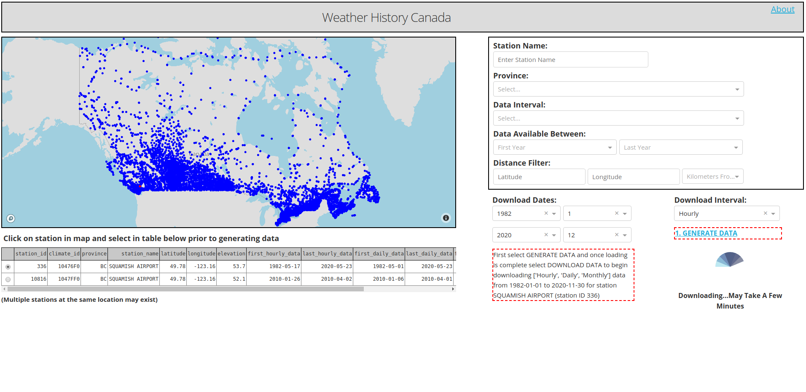
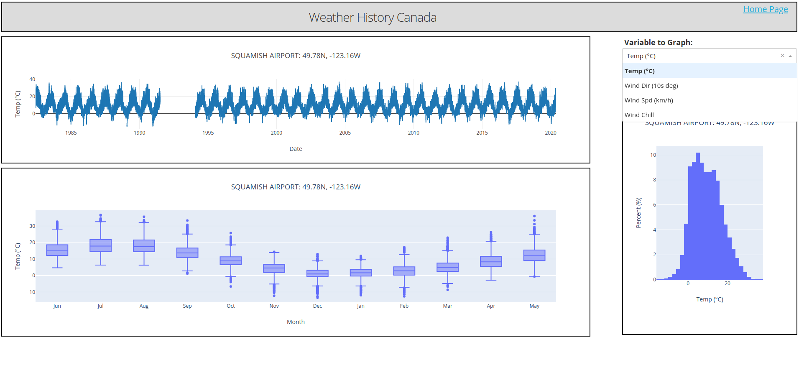

# Weather History Canada Web App

Weather History Canada is an open source web application tool for accessing historical 
weather data from over 8000 active and inactive Environment and Climate Change Canada 
(ECCC) maintained weather stations going as far back as 1840. With a few clicks of the 
mouse you can search, download, and visualize hourly, daily, and monthly ECCC weather data 
for any desired record length. The goal of Weather History Canada is to better the user 
experience by making it easier and quicker to download and interpret large amounts of 
historical weather data. 

[CLICK HERE TO VISIT SITE](http://www.weatherhistorycanada.com)

### Key Features
 
- Built in pure Python using Plotly Dash and deployed to a Heroku free dyno
- Periodic URL request via AWS Lambda to avoid sleeping of free Heroku dynos (i.e. eliminates slow load times)
- Map based searching and realtime filtering of weather stations based on multiple
criterion
- Execution of long-running tasks as background jobs via Celery and Heroku Redis to avoid 
Heroku request timeouts 
- Handles concurrent download requests via execution of tasks in Celery using Gunicorn 
Gevent worker class
- No file storage on disk. Downloads are stored on AWS S3 and delivered on request via
pre-signed URL
- Interactive graphing and figure capture to quickly visualize and share data
- Multi-browser functionality. Manually tested on Chrome 78, IE11, Firefox 68, and Safari 
10.1

### Screenshots

### What do the files do

[app.py](https://github.com/david-hurley/env-can-wx-app/blob/master/app.py)

This initializes the Plotly Dash app. It is called on by index.py 

[index.py](https://github.com/david-hurley/env-can-wx-app/blob/master/app.py)

This is where the app is referenced to the server. Data from different pages that persists in 
memory or session storage is referenced here. This sets the path to different pages. 

[tasks.py](https://github.com/david-hurley/env-can-wx-app/blob/master/tasks.py)

This connects the "Generate Data" request to Celery and Redis backend to download data. 
The results of the download are sent to AWS S3 bucket. 

[Procfile](https://github.com/david-hurley/env-can-wx-app/blob/master/Procfile)

File defining commands to be run by Heroku web and worker dynos. This tells Gunicorn to run
the web server. 

[home_page.py](https://github.com/david-hurley/env-can-wx-app/blob/master/pages/home_page.py)

Contains all of the application layout and callbacks for the Home Page. 
This includes the HTML and CSS and React.js callbacks.

[graph_page.py](https://github.com/david-hurley/env-can-wx-app/blob/master/pages/graph_page.py)

Contains all of the application layout and callbacks for the Graph Page. This is where 
the generated data is visualized. The figures can are interactive and can be saved as an image. 

[about.py](https://github.com/david-hurley/env-can-wx-app/blob/master/pages/about.py)

The What, Why, Who, and Where of Weather History Canada.

[chriddyp.css](https://github.com/david-hurley/env-can-wx-app/blob/master/assets/chriddyp.css)

Defualt Plotly Dash CSS styleguide. 

[style.css](https://github.com/david-hurley/env-can-wx-app/blob/master/assets/style.css)

This is extra styling for the app. 